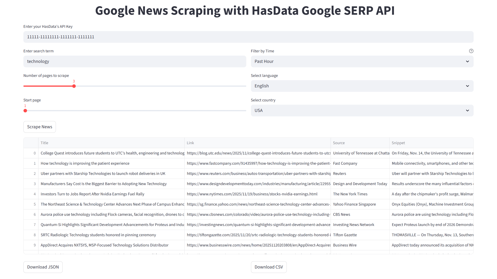

# Google News Scraper using HasData Google SERP API

[](https://hasdata.com/)

This Streamlit app lets you scrape **Google News** using the **HasData Google SERP API**.
You can search by keyword, filter results by time, language, or region, scrape multiple pages, preview the results, and export them as JSON or CSV.

It’s helpful for researchers, analysts, creators, and teams who need structured Google News data without writing code.

## 🚀 What This App Does

[](https://news-scraper-from-serp.streamlit.app/)

You can enter your HasData API key, define a search query, choose time and region filters, and run a multi-page scrape of Google News.
The app sends your query to HasData’s Google SERP API, fetches the `newsResults`, and displays them in a clean table.
Everything happens inside Streamlit, so you can run it even if you're not a developer.

You can export the scraped data to JSON or CSV and use it for reporting, automation, dashboards, or research.

## 🛠️ Installation

Requires Python 3.11+.

```bash
pip install streamlit pandas requests
```

## ▶️ Run the App

```bash
streamlit run app.py
```

Replace `app.py` if your file name is different.

## How It Works

You begin by entering your **HasData API key**. Then you select a keyword, the number of pages you want to scrape, the starting page, and any filters that match your region or language.
There’s also a time filter so you can focus on fresh news: past hour, day, week, month, or year.

The app builds a Google News request with these parameters and sends it to:

```
https://api.hasdata.com/scrape/google/serp
```

Each response returns structured news items, including title, link, snippet, source, publication date, and thumbnail.
The results appear in a data table and can immediately be downloaded.

## Output

Each scraped article includes:

* title
* link
* source
* snippet
* publication date
* thumbnail

Time filters and pagination make it possible to use this dataset for trend analysis, research, SEO monitoring, sentiment work, or automated reporting.

## Disclaimer

These examples are for **educational purposes** only. Learn more about [the legality of web scraping](https://hasdata.com/blog/is-web-scraping-legal).


## 📎 More Resources

* [Scraping Google News: The 2025 Python Guide](https://hasdata.com/blog/web-scraping-google-news)
* [HasData Google SERP API](https://hasdata.com/google-serp-api)
* [Join the community on Discord](https://hasdata.com/join-discord)

* [Star this repo if helpful ⭐](#)

